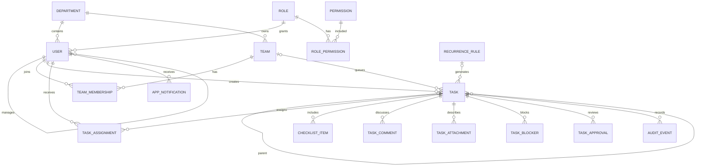

# Phase 02 Local Data Model

## Scope and ownership

Drift/SQLite is the source of truth for synthetic organization, task, collaboration, notification, audit, sync-queue, and setting records. Domain entities are immutable Dart objects and do not depend on Drift or Flutter. Repositories are the only domain-facing persistence boundary; DAOs own queries and mappers own row conversion.

## Important policies

* IDs are deterministic, string/UUID-compatible identifiers. `taskNumber` and employee numbers are unique.
* Optional relationships represent genuine absence: a queue task may have no lead owner; a top-level task has no parent; due time and English copy are optional. Subtasks reuse `tasks.parentTaskId`; demo data permits only one level.
* Tasks use soft deletion. Organization/configuration parent deletion is restricted by foreign keys; audit records have append/read-only repository access.
* `DateTime` values are normalized to UTC. Seed dates derive from injected `AppClock`, and tests use `FixedAppClock`.
* Enums persist stable lowercase snake-case codes. Unknown stored values map to explicit `unknown` fallbacks rather than throwing.
* Schema version 1 has explicit `onCreate`, rejecting `onUpgrade`, and `beforeOpen` hooks. Foreign keys are enabled on every connection. Future versions require additive, tested migrations; there is no destructive fallback.
* Seed version `demo_seed_version=1` makes initialization idempotent. Reset runs transactionally, clears every demo-owned table in child-to-parent order, then recreates deterministic organization/configuration/scenarios. This phase contains synthetic data only, so reset preserves no user data.
* Sync columns and queue records model local/server versions, local modification, deletion, pending operations, and conflicts. No synchronization processor or network exists.
* The connection factory isolates engine configuration. The demo SQLite file is **not encrypted**. Production must adopt an approved encrypted SQLite/SQLCipher-equivalent configuration and validate key management before storing real or confidential data.
* Future on-premises DTOs must map through repository/data mappers. Storage rows never cross into domain or presentation.

## Explicit non-model

Projects, milestones, portfolios, Gantt structures, and project relationships do not exist. No task has a `projectId`.

## Phase 02B local data boundary

Focused typed Drift DAOs own query composition: `UserDao`, `OrganizationDao`, `TaskDao`, `TaskConfigurationDao`, `NotificationDao`, `AuditDao`, `SyncDao`, and `SettingsDao`. DAOs return generated storage rows only and contain no lifecycle rules. Explicit mapper extensions are the only Drift-row/domain boundary; repositories return Drift-independent domain entities and are the only data contracts exposed to presentation.

The deterministic versioned seed contains the five personas, twelve synthetic employees, all departments and teams, memberships, roles/permissions, five priorities, ten categories, four confidentiality levels, rules and templates. SCN-01 includes checklist/history; SCN-02 pending approval/evidence configuration; SCN-03 returned approval/history; SCN-04 active external blocker/comment; SCN-05 lead and cross-department contributors; SCN-06 twelve independent batch copies; SCN-07 claimed and unclaimed queue tasks; SCN-08 reassignment history; SCN-09 extension request; SCN-10 three independent recurrence occurrences; SCN-11 restricted data; SCN-12 pending offline operation; SCN-13 conflict operation; SCN-14 stored AI-demo draft text only; and SCN-15 effort/blocker/count context records.

Reset is one transaction and deletes children before parents: role permissions/memberships, task collaboration records, audit/sync/notifications, tasks/recurrence/configuration, organization records, filters, then settings. The schema remains intact and the seed-version setting is recreated last. Tests use `NativeDatabase.memory()`, a `FixedAppClock`, provider overrides, and close every database. `app_database.g.dart` is build-runner output: never hand-edit or fabricate it; regenerate after table or DAO changes.

## Emergency deadline persistence pivot (2026-07-26)

Drift/SQLite, generated database code, DAOs, companions, SQL, database mappers, and build_runner are removed from the active deadline demo. The historical Phase 02 implementation is retained under `archive/drift_phase_02/` outside active compilation.

The active application uses one deterministic, Flutter-independent `DemoDataStore` and typed in-memory repository implementations. Repository interfaces remain the application boundary and are ready to be replaced by future on-premises API adapters without presentation changes. Runtime mutations and the simulated authentication session reset whenever the application restarts; this is demo state, not production persistence. Authentication roles are a repository-authoritative demo identity. No networking, cloud, Firebase, backend, real biometric, or external identity integration was added.

Phase 04 was not started.
